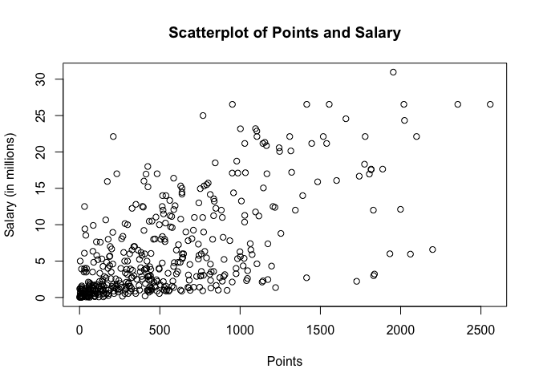
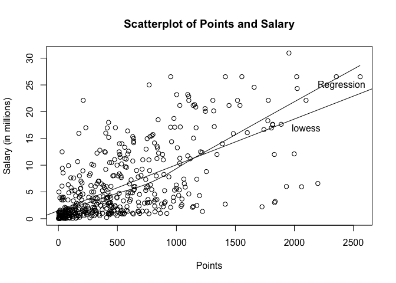
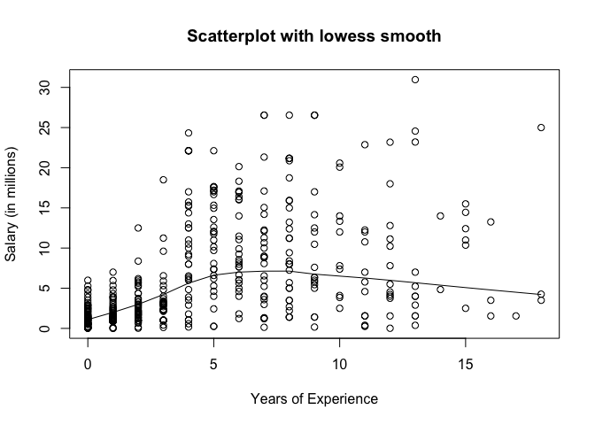
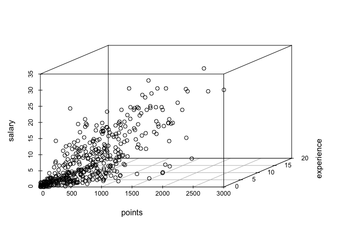
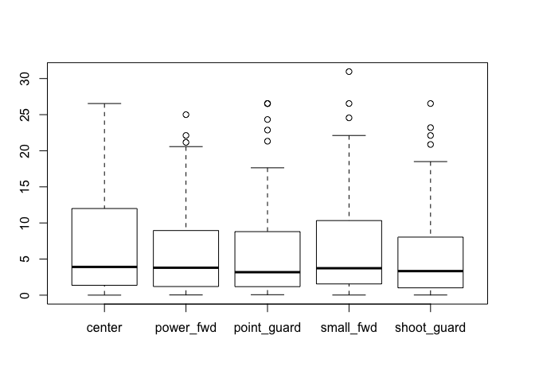

HW1
================

``` r
# load data file
load("data/nba2017-salary-points.RData")
ls()
```

    ## [1] "experience" "player"     "points"     "points1"    "points2"   
    ## [6] "points3"    "position"   "salary"     "team"

``` r
#Part 1
#salary convert
salary = salary / 1000000

# replace R with 0
experience = replace(experience, experience == "R", "0")
# create variable scale
scale <- 0
#create experience variable as int vector
experience<-c(experience)
#create position variable as R factor
position<-factor(position)
levels(position)[levels(position)=="C"] <- 'center'
levels(position)[levels(position)=="SF"] <- 'small_fwd'
levels(position)[levels(position)=="PF"] <- 'power_fwd'
levels(position)[levels(position)=="SG"] <- 'shoot_guard'
levels(position)[levels(position)=="PG"] <- 'point_guard'

table(position)
```

    ## position
    ##      center   power_fwd point_guard   small_fwd shoot_guard 
    ##          89          89          85          83          95

``` r
#Part2
plot(points, salary, main="Scatterplot of Points and Salary",
  xlab="Points", ylab="Salary (in millions)")
```



``` r
# Part 3 manually do correlation

x_mean = sum(points) / length(points)
y_mean = sum(salary) / length(salary)
var_x = 1/(length(points) - 1) * sum((points - x_mean)*(points - x_mean))
var_y = 1/(length(salary) - 1) * sum((salary - y_mean)*(salary - y_mean))
sd_x = sqrt(var_x)
sd_y = sqrt(var_y)
cov_xy =1/(length(points) - 1) * sum((points - x_mean)*(salary - y_mean))
cor_xy = cov_xy/(sd_x*sd_y)


# Part 4 Simple Linear Regression
b_1 = cor_xy * (sd_y/sd_x)
b_0 = y_mean - b_1*x_mean

Y_hat = b_0 + b_1*points
summary(Y_hat)
```

    ##    Min. 1st Qu.  Median    Mean 3rd Qu.    Max. 
    ##   1.510   2.845   5.206   6.187   8.184  23.400

``` r
predicted = b_0 + b_1*0
print (predicted)
```

    ## [1] 1.509886

``` r
predicted = b_0 + b_1*100
print (predicted)
```

    ## [1] 2.365554

``` r
predicted = b_0 + b_1*500
print (predicted)
```

    ## [1] 5.788226

``` r
predicted = b_0 + b_1*1000
print (predicted)
```

    ## [1] 10.06657

``` r
predicted = b_0 + b_1*2000
print (predicted)
```

    ## [1] 18.62325

``` r
#answers to questions:
```

regression equation = 0.008556681x + 1.509886.

Predicted salary for 0 points player is 1.509886 million.

Predicted salary for 100 points player is 2.365554 million.

Predicted salary for 500 points player is 5.788226 million.

Predicted salary for 1000 points player is 10.06657 million.

Predicted salary for 2000 points player is 18.62325 million

``` r
#part 5 plot the regression line
plot(points, salary, main="Scatterplot of Points and Salary",
  xlab="Points", ylab="Salary (in millions)")

abline(a = b_0, b = b_1)
lines(lowess(x = points ,y= salary))
```



``` r
# Part 6

e = salary - predicted
summary(e)
```

    ##    Min. 1st Qu.  Median    Mean 3rd Qu.    Max. 
    ## -18.620 -17.340 -15.120 -12.440  -9.373  12.340

``` r
RSS = sum(e*e)
print (RSS)
```

    ## [1] 87208.5

``` r
TSS = sum((salary - y_mean)*(salary - y_mean))
print (TSS)
```

    ## [1] 19003.48

``` r
R_sqr = 1 - (RSS/TSS)
print (R_sqr)
```

    ## [1] -3.58908

``` r
#Part 7
#install.packages("scatterplot3d") # Install
library("scatterplot3d") # load
```

    ## Warning: package 'scatterplot3d' was built under R version 3.3.2

``` r
plot(experience, salary, main="Scatterplot with lowess smooth",
  xlab="Years of Experience", ylab="Salary (in millions)")

lines(lowess(x = experience ,y= salary))
```



``` r
scatterplot3d(points, experience, salary)
```



``` r
boxplot(salary~position)
```



From the first graph we see that NBA player reach their salary peak after about 6-7 years experience, and then would have a rapid decrease.

From the scatterplots, experience does seem to be related to salary.

From the boxplot, position doesn't seem to be related to salary.

Part 8

The thing that was hard to me is the use of ABline. I had no previous knowledge in how to plot regression line.

I don't need help for project, but I spent 3 hours on it.

Plot is really annoying to me but graphical visualization is cool
