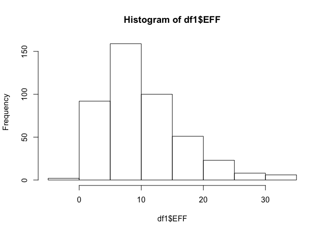
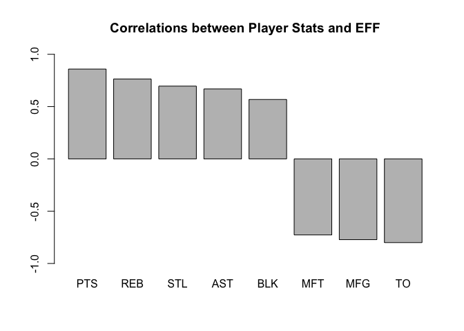
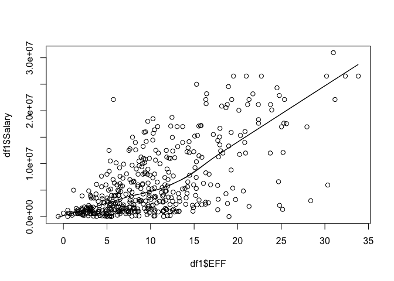
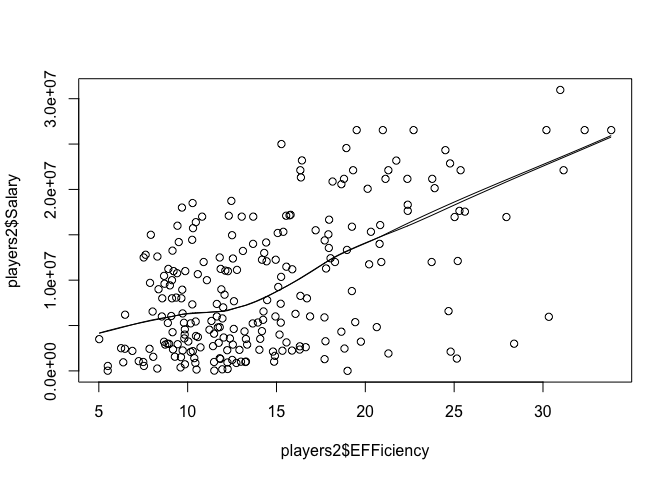

hw02-Lai-Wei
================

``` r
#install.packages("readr")
github <- "https://github.com/ucb-stat133/stat133-fall-2017/raw/master/"
file <- "data/nba2017-player-statistics.csv"
csv <- paste0(github, file)
download.file(url = csv, destfile = 'nba2017-player-statistics.csv')
```

``` r
library(readr)
```

    ## Warning: package 'readr' was built under R version 3.3.2

``` r
# vector of data types (for each column)
col_types <- c(
    'character', 'character', 'factor', 'character', 'double','integer', 'integer', 'integer', 'integer','integer', 'integer','integer', 'integer','integer', 'integer','integer', 'integer','integer', 'integer','integer', 'integer','integer', 'integer','integer'
)

df1 <- read.csv(
    'nba2017-player-statistics.csv',
    header = TRUE,
    colClasses = col_types,
    sep = ","
)

df2 <- read_csv(
  'nba2017-player-statistics.csv',
   col_types  = list(col_character(), col_character(), col_factor(c("C", "PF", "PG", "SF", "SG")), col_character(), col_double(), col_integer(), col_integer(),col_integer(),col_integer(),col_integer(),col_integer(),col_integer(),col_integer(),col_integer(),col_integer(),col_integer(),col_integer(),col_integer(),col_integer(),col_integer(),col_integer(),col_integer(),col_integer(),col_integer())
)

str(df2)
```

    ## Classes 'tbl_df', 'tbl' and 'data.frame':    441 obs. of  24 variables:
    ##  $ Player      : chr  "Al Horford" "Amir Johnson" "Avery Bradley" "Demetrius Jackson" ...
    ##  $ Team        : chr  "BOS" "BOS" "BOS" "BOS" ...
    ##  $ Position    : Factor w/ 5 levels "C","PF","PG",..: 1 2 5 3 4 3 4 5 4 2 ...
    ##  $ Experience  : chr  "9" "11" "6" "R" ...
    ##  $ Salary      : num  26540100 12000000 8269663 1450000 1410598 ...
    ##  $ Rank        : int  4 6 5 15 11 1 3 13 8 10 ...
    ##  $ Age         : int  30 29 26 22 31 27 26 21 20 29 ...
    ##  $ GP          : int  68 80 55 5 47 76 72 29 78 78 ...
    ##  $ GS          : int  68 77 55 0 0 76 72 0 20 6 ...
    ##  $ MIN         : int  2193 1608 1835 17 538 2569 2335 220 1341 1232 ...
    ##  $ FGM         : int  379 213 359 3 95 682 333 25 192 114 ...
    ##  $ FGA         : int  801 370 775 4 232 1473 720 58 423 262 ...
    ##  $ Points3     : int  86 27 108 1 39 245 157 12 46 45 ...
    ##  $ Points3_atts: int  242 66 277 1 111 646 394 35 135 130 ...
    ##  $ Points2     : int  293 186 251 2 56 437 176 13 146 69 ...
    ##  $ Points2_atts: int  559 304 498 3 121 827 326 23 288 132 ...
    ##  $ FTM         : int  108 67 68 3 33 590 176 6 85 26 ...
    ##  $ FTA         : int  135 100 93 6 41 649 217 9 124 37 ...
    ##  $ OREB        : int  95 117 65 2 17 43 48 6 45 60 ...
    ##  $ DREB        : int  369 248 269 2 68 162 367 20 175 213 ...
    ##  $ AST         : int  337 140 121 3 33 449 155 4 64 71 ...
    ##  $ STL         : int  52 52 68 0 9 70 72 10 35 26 ...
    ##  $ BLK         : int  87 62 11 0 7 13 23 2 18 17 ...
    ##  $ TO          : int  116 77 88 0 25 210 79 4 68 39 ...
    ##  - attr(*, "spec")=List of 2
    ##   ..$ cols   :List of 24
    ##   .. ..$ Player      : list()
    ##   .. .. ..- attr(*, "class")= chr  "collector_character" "collector"
    ##   .. ..$ Team        : list()
    ##   .. .. ..- attr(*, "class")= chr  "collector_character" "collector"
    ##   .. ..$ Position    :List of 3
    ##   .. .. ..$ levels    : chr  "C" "PF" "PG" "SF" ...
    ##   .. .. ..$ ordered   : logi FALSE
    ##   .. .. ..$ include_na: logi FALSE
    ##   .. .. ..- attr(*, "class")= chr  "collector_factor" "collector"
    ##   .. ..$ Experience  : list()
    ##   .. .. ..- attr(*, "class")= chr  "collector_character" "collector"
    ##   .. ..$ Salary      : list()
    ##   .. .. ..- attr(*, "class")= chr  "collector_double" "collector"
    ##   .. ..$ Rank        : list()
    ##   .. .. ..- attr(*, "class")= chr  "collector_integer" "collector"
    ##   .. ..$ Age         : list()
    ##   .. .. ..- attr(*, "class")= chr  "collector_integer" "collector"
    ##   .. ..$ GP          : list()
    ##   .. .. ..- attr(*, "class")= chr  "collector_integer" "collector"
    ##   .. ..$ GS          : list()
    ##   .. .. ..- attr(*, "class")= chr  "collector_integer" "collector"
    ##   .. ..$ MIN         : list()
    ##   .. .. ..- attr(*, "class")= chr  "collector_integer" "collector"
    ##   .. ..$ FGM         : list()
    ##   .. .. ..- attr(*, "class")= chr  "collector_integer" "collector"
    ##   .. ..$ FGA         : list()
    ##   .. .. ..- attr(*, "class")= chr  "collector_integer" "collector"
    ##   .. ..$ Points3     : list()
    ##   .. .. ..- attr(*, "class")= chr  "collector_integer" "collector"
    ##   .. ..$ Points3_atts: list()
    ##   .. .. ..- attr(*, "class")= chr  "collector_integer" "collector"
    ##   .. ..$ Points2     : list()
    ##   .. .. ..- attr(*, "class")= chr  "collector_integer" "collector"
    ##   .. ..$ Points2_atts: list()
    ##   .. .. ..- attr(*, "class")= chr  "collector_integer" "collector"
    ##   .. ..$ FTM         : list()
    ##   .. .. ..- attr(*, "class")= chr  "collector_integer" "collector"
    ##   .. ..$ FTA         : list()
    ##   .. .. ..- attr(*, "class")= chr  "collector_integer" "collector"
    ##   .. ..$ OREB        : list()
    ##   .. .. ..- attr(*, "class")= chr  "collector_integer" "collector"
    ##   .. ..$ DREB        : list()
    ##   .. .. ..- attr(*, "class")= chr  "collector_integer" "collector"
    ##   .. ..$ AST         : list()
    ##   .. .. ..- attr(*, "class")= chr  "collector_integer" "collector"
    ##   .. ..$ STL         : list()
    ##   .. .. ..- attr(*, "class")= chr  "collector_integer" "collector"
    ##   .. ..$ BLK         : list()
    ##   .. .. ..- attr(*, "class")= chr  "collector_integer" "collector"
    ##   .. ..$ TO          : list()
    ##   .. .. ..- attr(*, "class")= chr  "collector_integer" "collector"
    ##   ..$ default: list()
    ##   .. ..- attr(*, "class")= chr  "collector_guess" "collector"
    ##   ..- attr(*, "class")= chr "col_spec"

``` r
df1 <- data.frame(df1)
df2 <- data.frame(df2)

str(df2)
```

    ## 'data.frame':    441 obs. of  24 variables:
    ##  $ Player      : chr  "Al Horford" "Amir Johnson" "Avery Bradley" "Demetrius Jackson" ...
    ##  $ Team        : chr  "BOS" "BOS" "BOS" "BOS" ...
    ##  $ Position    : Factor w/ 5 levels "C","PF","PG",..: 1 2 5 3 4 3 4 5 4 2 ...
    ##  $ Experience  : chr  "9" "11" "6" "R" ...
    ##  $ Salary      : num  26540100 12000000 8269663 1450000 1410598 ...
    ##  $ Rank        : int  4 6 5 15 11 1 3 13 8 10 ...
    ##  $ Age         : int  30 29 26 22 31 27 26 21 20 29 ...
    ##  $ GP          : int  68 80 55 5 47 76 72 29 78 78 ...
    ##  $ GS          : int  68 77 55 0 0 76 72 0 20 6 ...
    ##  $ MIN         : int  2193 1608 1835 17 538 2569 2335 220 1341 1232 ...
    ##  $ FGM         : int  379 213 359 3 95 682 333 25 192 114 ...
    ##  $ FGA         : int  801 370 775 4 232 1473 720 58 423 262 ...
    ##  $ Points3     : int  86 27 108 1 39 245 157 12 46 45 ...
    ##  $ Points3_atts: int  242 66 277 1 111 646 394 35 135 130 ...
    ##  $ Points2     : int  293 186 251 2 56 437 176 13 146 69 ...
    ##  $ Points2_atts: int  559 304 498 3 121 827 326 23 288 132 ...
    ##  $ FTM         : int  108 67 68 3 33 590 176 6 85 26 ...
    ##  $ FTA         : int  135 100 93 6 41 649 217 9 124 37 ...
    ##  $ OREB        : int  95 117 65 2 17 43 48 6 45 60 ...
    ##  $ DREB        : int  369 248 269 2 68 162 367 20 175 213 ...
    ##  $ AST         : int  337 140 121 3 33 449 155 4 64 71 ...
    ##  $ STL         : int  52 52 68 0 9 70 72 10 35 26 ...
    ##  $ BLK         : int  87 62 11 0 7 13 23 2 18 17 ...
    ##  $ TO          : int  116 77 88 0 25 210 79 4 68 39 ...

``` r
str(df1)
```

    ## 'data.frame':    441 obs. of  24 variables:
    ##  $ Player      : chr  "Al Horford" "Amir Johnson" "Avery Bradley" "Demetrius Jackson" ...
    ##  $ Team        : chr  "BOS" "BOS" "BOS" "BOS" ...
    ##  $ Position    : Factor w/ 5 levels "C","PF","PG",..: 1 2 5 3 4 3 4 5 4 2 ...
    ##  $ Experience  : chr  "9" "11" "6" "R" ...
    ##  $ Salary      : num  26540100 12000000 8269663 1450000 1410598 ...
    ##  $ Rank        : int  4 6 5 15 11 1 3 13 8 10 ...
    ##  $ Age         : int  30 29 26 22 31 27 26 21 20 29 ...
    ##  $ GP          : int  68 80 55 5 47 76 72 29 78 78 ...
    ##  $ GS          : int  68 77 55 0 0 76 72 0 20 6 ...
    ##  $ MIN         : int  2193 1608 1835 17 538 2569 2335 220 1341 1232 ...
    ##  $ FGM         : int  379 213 359 3 95 682 333 25 192 114 ...
    ##  $ FGA         : int  801 370 775 4 232 1473 720 58 423 262 ...
    ##  $ Points3     : int  86 27 108 1 39 245 157 12 46 45 ...
    ##  $ Points3_atts: int  242 66 277 1 111 646 394 35 135 130 ...
    ##  $ Points2     : int  293 186 251 2 56 437 176 13 146 69 ...
    ##  $ Points2_atts: int  559 304 498 3 121 827 326 23 288 132 ...
    ##  $ FTM         : int  108 67 68 3 33 590 176 6 85 26 ...
    ##  $ FTA         : int  135 100 93 6 41 649 217 9 124 37 ...
    ##  $ OREB        : int  95 117 65 2 17 43 48 6 45 60 ...
    ##  $ DREB        : int  369 248 269 2 68 162 367 20 175 213 ...
    ##  $ AST         : int  337 140 121 3 33 449 155 4 64 71 ...
    ##  $ STL         : int  52 52 68 0 9 70 72 10 35 26 ...
    ##  $ BLK         : int  87 62 11 0 7 13 23 2 18 17 ...
    ##  $ TO          : int  116 77 88 0 25 210 79 4 68 39 ...

``` r
df1$Experience <- chartr("R", "0", df1$Experience)
df1<-transform(df1, Experience = as.integer(Experience))
df2$Experience <- chartr("R", "0", df2$Experience)
df2<-transform(df1, Experience = as.integer(Experience))

df1$Missed_FG <- df1$FGA - df1$FGM
df1$Missed_FT <- df1$FTA - df1$FTM
df1$PTS <-df1$Points3*3 + df1$Points2*2 + df1$FTM
df1$REB <-df1$OREB + df1$DREB
df1$MPG <- df1$MIN / df1$GP
df1$EFF <- (df1$PTS + df1$REB + df1$AST + df1$STL + df1$BLK - df1$Missed_FG - df1$Missed_FT - df1$TO) / df1$GP
summary(df1$EFF)
```

    ##    Min. 1st Qu.  Median    Mean 3rd Qu.    Max. 
    ##  -0.600   5.452   9.090  10.140  13.250  33.840

``` r
print (hist(df1$EFF),  main="Histogram of EFF", xlab="EFF")
```



    ## $breaks
    ## [1] -5  0  5 10 15 20 25 30 35
    ## 
    ## $counts
    ## [1]   2  92 159 100  51  23   8   6
    ## 
    ## $density
    ## [1] 0.0009070295 0.0417233560 0.0721088435 0.0453514739 0.0231292517
    ## [6] 0.0104308390 0.0036281179 0.0027210884
    ## 
    ## $mids
    ## [1] -2.5  2.5  7.5 12.5 17.5 22.5 27.5 32.5
    ## 
    ## $xname
    ## [1] "df1$EFF"
    ## 
    ## $equidist
    ## [1] TRUE
    ## 
    ## attr(,"class")
    ## [1] "histogram"

``` r
str(df1[ c(1:10), c(1, 2, 5,30)])
```

    ## 'data.frame':    10 obs. of  4 variables:
    ##  $ Player: chr  "Al Horford" "Amir Johnson" "Avery Bradley" "Demetrius Jackson" ...
    ##  $ Team  : chr  "BOS" "BOS" "BOS" "BOS" ...
    ##  $ Salary: num  26540100 12000000 8269663 1450000 1410598 ...
    ##  $ EFF   : num  19.51 10.9 16.35 2.6 4.81 ...

``` r
df1[df1$EFF < 0,'Player']
```

    ## [1] "Patricio Garino"

``` r
cor_pts <-cor(df1$PTS, df1$EFF)
cor_reb<-cor(df1$REB, df1$EFF)
cor_ast<-cor(df1$AST, df1$EFF)
cor_stl<-cor(df1$STL, df1$EFF)
cor_blk<-cor(df1$BLK, df1$EFF)
cor_mfg<-cor(-df1$Missed_FG, df1$EFF)
cor_mft<-cor(-df1$Missed_FT, df1$EFF)
cor_to<-cor(-df1$TO, df1$EFF)

corre <- data.frame(
  category <- c('PTS', 'REB', 'AST', 'STL', 'BLK', 'MFG','MFT', 'TO'),
  influence <- c(cor_pts, cor_reb, cor_ast, cor_stl, cor_blk, cor_mfg, cor_mft, cor_to)
)
corre <- corre[order(-corre$influence),]
corre
```

    ##   category....c..PTS....REB....AST....STL....BLK....MFG....MFT...
    ## 1                                                             PTS
    ## 2                                                             REB
    ## 4                                                             STL
    ## 3                                                             AST
    ## 5                                                             BLK
    ## 7                                                             MFT
    ## 6                                                             MFG
    ## 8                                                              TO
    ##   influence....c.cor_pts..cor_reb..cor_ast..cor_stl..cor_blk..cor_mfg..
    ## 1                                                             0.8588644
    ## 2                                                             0.7634501
    ## 4                                                             0.6957286
    ## 3                                                             0.6689232
    ## 5                                                             0.5679571
    ## 7                                                            -0.7271456
    ## 6                                                            -0.7722477
    ## 8                                                            -0.8003289

``` r
barplot( corre$influence,  
  main = "Correlations between Player Stats and EFF", ylim=c(-1,1), names.arg = corre$category)
```



``` r
scatter.smooth(df1$EFF, df1$Salary)
lines(lowess(x = df1$EFF ,y= df1$Salary))
```



``` r
print (cor(df1$EFF, df1$Salary))
```

    ## [1] 0.655624

``` r
print ("The relationship between these  players is in positive linear relationship. ")
```

    ## [1] "The relationship between these  players is in positive linear relationship. "

``` r
players2 <-data.frame(
  people <- c(df1[df1$MPG >= 20,'Player']),
  EFFiciency <-  c(df1[df1$MPG >= 20,'EFF']),
  Salary <-  c(df1[df1$MPG >= 20,'Salary'])
)
scatter.smooth(players2$EFFiciency, players2$Salary)
lines(lowess(x = players2$EFFiciency ,y= players2$Salary))
```



``` r
print (cor(players2$EFFiciency, players2$Salary))
```

    ## [1] 0.5367224

The relationship between these more established players is in positive linear relationship.

Part 6 I think the homework is very difficult. It's hard especially in how to do condition filter in dataframe. It's all hard. I searched google for so many hours. 10 hours to finish it. graphing.
