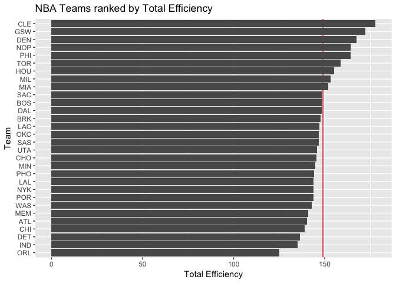

hw03-Lai-Wei.RMD
================

``` r
library(readr)   
```

    ## Warning: package 'readr' was built under R version 3.3.2

``` r
library(dplyr)   
```

    ## Warning: package 'dplyr' was built under R version 3.3.2

    ## 
    ## Attaching package: 'dplyr'

    ## The following objects are masked from 'package:stats':
    ## 
    ##     filter, lag

    ## The following objects are masked from 'package:base':
    ## 
    ##     intersect, setdiff, setequal, union

``` r
library(ggplot2) 
```

    ## Warning: package 'ggplot2' was built under R version 3.3.2

TEAMS Ranking

``` r
teams = read.csv("~/Desktop/stat133/stat133-hws-fall17/hw03/data/teams.csv")
arranged_teams = arrange(teams, desc(salary))
```

    ## Warning: package 'bindrcpp' was built under R version 3.3.2

``` r
ggplot(teams, aes(reorder(team, salary), y = salary)) + geom_bar(stat = 'identity') + coord_flip() + geom_hline(yintercept= mean(teams$salary), color = 'red') + ggtitle('NBA Teams ranked by Salary') + xlab('Team') + ylab("Salary (in millions)")
```


``` r
ggplot(teams, aes(reorder(team, points), y = points)) + geom_bar(stat = 'identity') + coord_flip() + geom_hline(yintercept= mean(teams$points), color = 'red') + ggtitle('NBA Teams ranked by Total Points') + xlab('Team') + ylab("Total Points")
```


``` r
ggplot(teams, aes(reorder(team, efficiency), y = efficiency)) + geom_hline(yintercept= mean(teams$efficiency), color = 'red') + geom_bar(stat = 'identity') + coord_flip()+ ggtitle('NBA Teams ranked by Total Efficiency') + xlab('Team') + ylab("Total Efficiency")
```



``` r
#Concise descriptions of the rankings:
# Total points made are more important than efficiency because GSW beats CLE in final.

pca_prep = select(teams,points3,points2,free_throws,off_rebounds,def_rebounds, assists, steals, blocks, turnovers, fouls)
pca = prcomp(pca_prep, scale. = TRUE)
teams <- mutate(teams, pc1 = pca$x[ ,1],pc2 = pca$x[ ,2])
# Create a data frame witheigenvalues
eigns <- data.frame(
  eigenvalue = pca$sdev^2,
  prop = round((pca$sdev^2/sum(pca$sdev^2)), 4))
eigns = mutate(eigns, cumprop = cumsum(prop))
eigns
```

    ##    eigenvalue   prop cumprop
    ## 1  4.69588631 0.4696  0.4696
    ## 2  1.70201009 0.1702  0.6398
    ## 3  0.97952464 0.0980  0.7378
    ## 4  0.77171938 0.0772  0.8150
    ## 5  0.53408824 0.0534  0.8684
    ## 6  0.47801622 0.0478  0.9162
    ## 7  0.38220374 0.0382  0.9544
    ## 8  0.26026243 0.0260  0.9804
    ## 9  0.13359274 0.0134  0.9938
    ## 10 0.06269622 0.0063  1.0001

``` r
ggplot(data = teams,aes(x=pc1,y =pc2))+
  geom_point()+
  geom_label(aes(label = team)) + ggtitle('PCA plot(PC1 and PC2)')
```


``` r
pc1 = pca$x[ , 1]
s1 = 100*(pc1 - min(pc1))/(max(pc1) - min(pc1)) 
ggplot(teams, aes(reorder(team, pc1), y = s1)) + geom_bar(stat='identity') + coord_flip()  + ggtitle('NBA Teams ranked by scaled PC1') + xlab('Team') + ylab("First PC(scaled from 0 to 100)")
```


``` r
# description:
# from the graph, we can see Golden state warriors have the highest PC1. No wonder they're the champion.
```

``` r
#Was this your first time working on a project with such file structure? If yes, how do you feel about it?
# Yes.

#Was this your first time using relative paths? If yes, can you tell why they are important for reproducibility purposes?
# No.we used relative path in exams as well.

#Was this your first time using  R script? If yes, what do you think about just writing code?
# No.

#What things were hard, even though you saw them in class/lab?
# I have no idea about PCA

#Was was easy?
 # merging is easy
```
