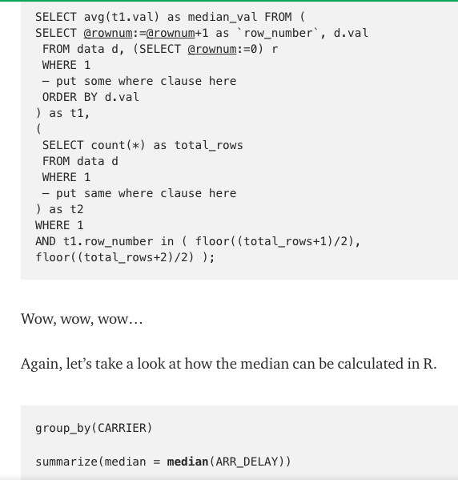

Post1
================

Simple&Fast Big Data Tool: Dplyr
================================

### Intro

Statistics is really all about analyzing data using various mathematical techniques. Unlike exams, when it comes to actual industry analysis, it’s no longer just math problem solving but actual data manipulations. All the statistical techniques such as calculating variance, means are all based on the fact that we can preprocess plain data beforehand. Some of the data in the original datable could be unnecessary or have some unwanted relationship with targeted data. So it’s important for data analytics to be able to manipulate data frames. In addition, it has to be easy to code so that analytics can focus on statical analysis instead of tedious codings. To accommodate this need, dplyr is invented. So far in this course, dplyr appears to be the most interesting topic. Prior to this course, I have experience in data miming and machine learning processing. Many features in R are universal across languages. For example, list, data frames, ggplot are all common tools in python. But it’s a little harder for python to manipulate datas, well, just a little harder. In python, if we want to preprocess datas, there’s a lot to do with panda library and Numpy array. In deep learning, data preprocessing is also a pain. The simplicity in R really appears beautiful to me.So this post is intended to write a throughout analysis on dplyr.

### Different Languages Comparison

For programming language like java, if one wants to filter out certain numbers in an array, he/she may need to do the below operation:


Java for filtering:


However, for dplyr we can simple do:

``` r
#fil <- filter(sel, salary > 80)
#head(fil)
```

Even if this piece of code is handed to a English speaker who doesn’t know coding, he/she could also directly tell what the meaning of it. Not only is easier for data analytics to write, but it’s also easy for coworkers to review the code.

To have a better overview of the power of dplyr, let’s look at some more examples.

``` r
library(dplyr)
```

    ## Warning: package 'dplyr' was built under R version 3.3.2

    ## 
    ## Attaching package: 'dplyr'

    ## The following objects are masked from 'package:stats':
    ## 
    ##     filter, lag

    ## The following objects are masked from 'package:base':
    ## 
    ##     intersect, setdiff, setequal, union

``` r
teams = read.csv("data/teams.csv")
# arrange order
arranged_teams = arrange(teams, desc(salary))
```

    ## Warning: package 'bindrcpp' was built under R version 3.3.2

``` r
head(arranged_teams)
```

    ##    X team experience salary points3 points2 free_throws points
    ## 1  6  CLE        128 125.79    1012    2107        1355   8605
    ## 2 13  LAC        124 114.78     841    2401        1586   8911
    ## 3 28  TOR         57 108.46     626    2359        1570   8166
    ## 4 15  MEM         83 108.34     750    2140        1465   7995
    ## 5 27  SAS         99 104.69     743    2459        1431   8578
    ## 6  9  DET         55 103.07     631    2638        1140   8309
    ##   off_rebounds def_rebounds assists steals blocks turnovers fouls
    ## 1          727         2639    1760    475    299      1005  1318
    ## 2          740         2790    1848    613    349      1024  1626
    ## 3          848         2533    1469    621    379       933  1609
    ## 4          866         2534    1669    612    329       973  1748
    ## 5          821         2768    1926    650    485      1038  1479
    ## 6          908         2838    1731    574    310       932  1467
    ##   efficiency        pc1        pc2
    ## 1   177.8585 -1.1429197 -1.9254795
    ## 2   147.1242  1.6926408 -0.7550453
    ## 3   158.7658  0.6469827  1.3120040
    ## 4   140.9707  0.6071090  0.4667924
    ## 5   146.6236  2.2990719 -0.1427248
    ## 6   136.3762  0.4228059  1.3520635

``` r
#select 
sel <- select(arranged_teams, experience, salary)
head(sel)
```

    ##   experience salary
    ## 1        128 125.79
    ## 2        124 114.78
    ## 3         57 108.46
    ## 4         83 108.34
    ## 5         99 104.69
    ## 6         55 103.07

``` r
#filter
fil <- filter(sel, salary > 80)
head(fil)
```

    ##   experience salary
    ## 1        128 125.79
    ## 2        124 114.78
    ## 3         57 108.46
    ## 4         83 108.34
    ## 5         99 104.69
    ## 6         55 103.07

``` r
# mutate
sel %>% 
    mutate(extra = experience /salary) %>%
    head
```

    ##   experience salary     extra
    ## 1        128 125.79 1.0175690
    ## 2        124 114.78 1.0803276
    ## 3         57 108.46 0.5255394
    ## 4         83 108.34 0.7661067
    ## 5         99 104.69 0.9456491
    ## 6         55 103.07 0.5336179

Dplyr Syntax reference: <http://genomicsclass.github.io/book/pages/dplyr_tutorial.html>

python on dataframe manipulation is almost as easy as in R's dplyr. However, it's a lot harder in creating the dataframes. Usually there's some numpy library related business, but it's very hard for people to distinguish between numpy and regular list. Also, python does a lot of list slicing and it's not obvious to beginners.

Below are a few examples about python dataframe from <https://pandas.pydata.org/pandas-docs/stable/indexing.html>:


### Run Time

In addition to handy usage, dplyr also beats plain R functions in runtime speed. According to <http://zevross.com/blog/2014/03/26/four-reasons-why-you-should-check-out-the-r-package-dplyr-3/>, dplyr process dataframes a lot faster than regular r functions. The runtime advantage appears when we try to use an external database. In regular r functions, R has to read the entire database into memory and process the data. This is obviously very small. However, dplyr enables us to process the data in external table without reading it to our memory. This direct connection makes the overall runtime speed as fast as possible.

### SQL vs Dplyr

As many people may know, SQL is the most popular language in database manipulation. Its syntax is also not very diffciult. According to <https://www.w3schools.com/sql/sql_and_or.asp>, 

But why isn't SQL chosen as a data analytic lanaguge but R and dplyr? I found one interesting article online explaining the reason: <https://blog.exploratory.io/why-sql-is-not-for-analysis-but-dplyr-is-5e180fef6aa7> .

Bascially, the author claims that syntax complexity is one of the major difference. Although SQL rule is pretty easy, but it can get very nested when there's heavy computation. For example:



Clearly, SQL becomes a mess while Dplyr stays elegant. I believe there's also run time complexity advantage in dplyr behind the syntax, but it's not revealed in this post.

### Dplyr in Big Data Processing

Dplyr demonstrates strong usage in big data processing. For example, sparkly is a package that allows analytics to connect to Spark from R. Spark is a big data processing platform which extends data manipulation into a distributed system that has excellent efficiency.


The usage of dplyr not only makes big data engineer’s job as easy as possible but also allow optimization in computation. According to <https://spark.rstudio.com/dplyr.html>, an important property of dplyr is its laziness. It would only execute until the moment when programmer hits run. img. Here, laziness is actually a good thing. The program driver is able to know the big picture after seeing the whole sequence of data operations and thus set up the best computational graph that speeds up the calculation.


To understand why laziness plays such an important role we need to first understand how Spark works. Prior to the invention of Spark, hadoop is the framework that’s largely adopted by big data community. Hadoop uses map reduce and master-slave mechanism to do parallel computation on distributed system. However, hadoop needs to output its temporary results to disk and read it from disk to memory for each map-reduce phase it does. Usually, reading from disk has a high IO time. To improve efficiency, Berkeley invented Spark which is a lot of like Hadoop but instead saves intermediate results on memory.

To figure out the best path, Spark needs to wait until the last moment to construct directed graph. Once driver programer gets executed, everythign needed has already been grouped by keys, and there's no need to retrieve items from HDFS disk. Dplyr’s laziness property perfectly supports Spark’s requirement.

Map-reduce to disk and Spark to memory:<https://www.tutorialspoint.com/apache_spark/apache_spark_rdd.htm>

### Conclusion

In the above discussion, I analyzed the syntax simplicity and run time speed advanatge, its direct connection to database, and its strong usage in big data processing. The functionalities go way beyond what's covered in class where we only play around with a couple of simple data frames and run on single machine. When it comes to distributed system dealing with millions of data, dyplyr's importance would truly shine due to its speed and simplicity.

### reference:

<https://www.tutorialspoint.com/apache_spark/apache_spark_rdd.htm>

<http://zevross.com/blog/2014/03/26/four-reasons-why-you-should-check-out-the-r-package-dplyr-3/>

<https://spark.rstudio.com/dplyr.html>

<https://blog.exploratory.io/why-sql-is-not-for-analysis-but-dplyr-is-5e180fef6aa7>

<http://genomicsclass.github.io/book/pages/dplyr_tutorial.html>

<https://pandas.pydata.org/pandas-docs/stable/indexing.html>

<https://www.w3schools.com/sql/sql_and_or.asp>
