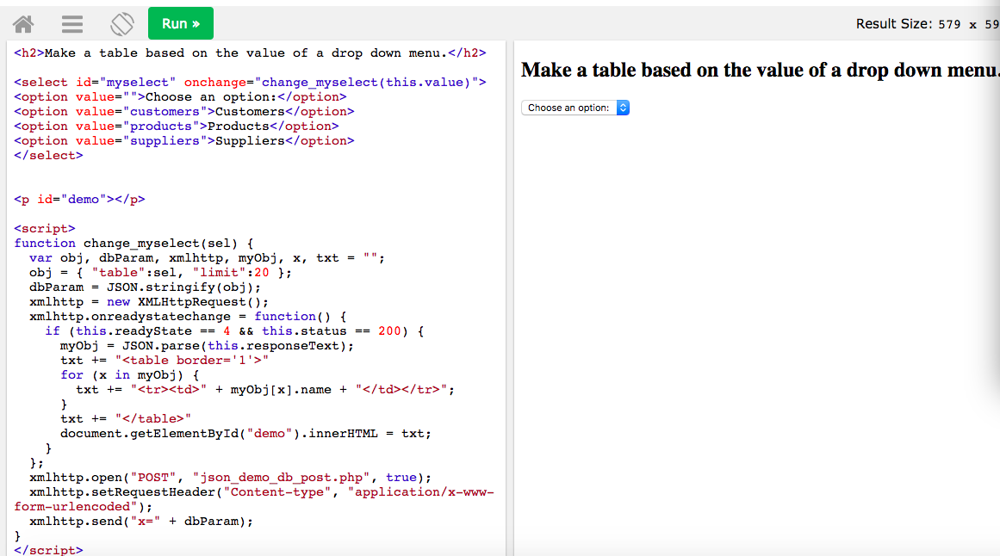
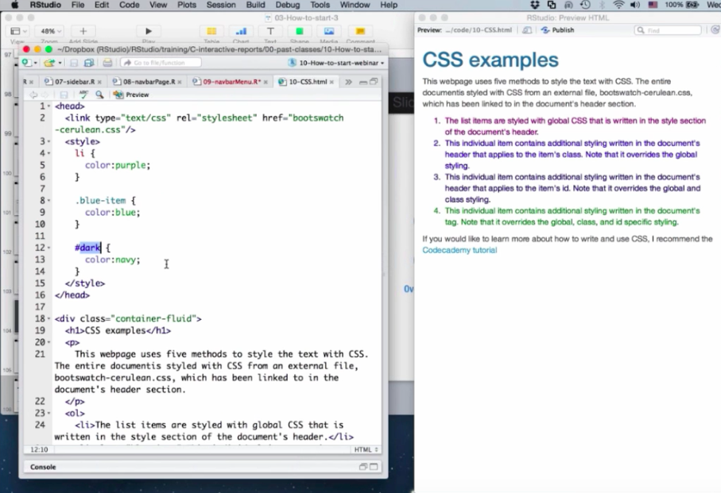
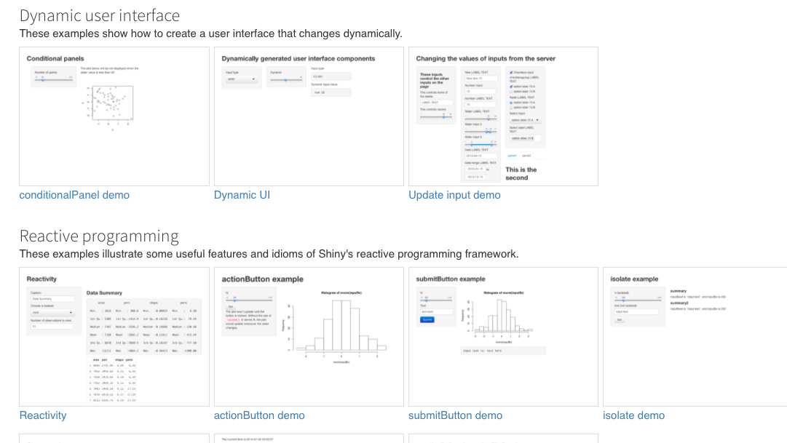
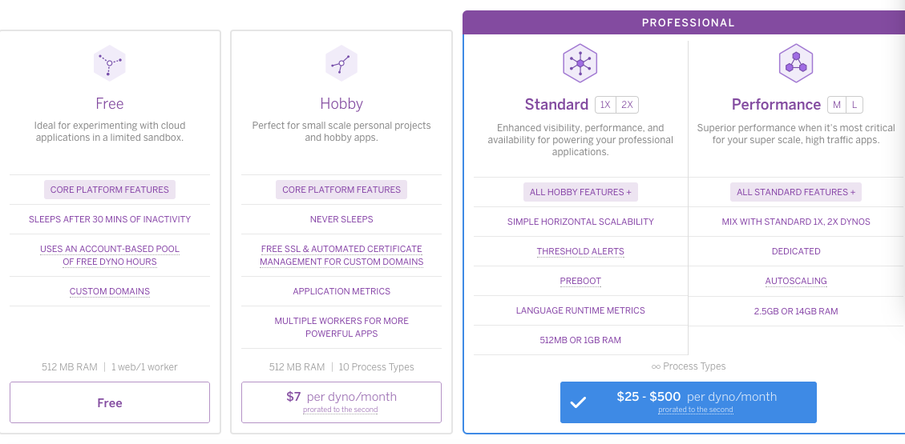

Post2
================

Simple&Fast Web Data Tool: Shiny
================================

### Intro

Shiny App is a powerful tool to create web app for data engineers & scientists. It makes web visualization and interaction become very easy for data engineers. In the past, I really cannot tell the difference between R and python in their data processing ability. But after experiecing with shiny, I have to say R has a better visualization ability for its customers. I have been a web programmers for quite a long time, and I know how time-consuming it is to make website. If a data scienists has to spend a lot of time on web creation, it's going to lower their data analysis quality. I am a computer science major student and I have been through a lot of difficulities in creating websites before. It's a pain to spend a lot of time to build something that's only served to display some other contents. Therefore, in this Post, I'll make a comparsion between normal web development process and R web process and demonstrate some of Shiny's advantages.

This is how a data analytics would normally create a interactive website using shiny package in R. This demo is from <https://shiny.rstudio.com/>. It has a nice option control as well as date range input fields. Also, the chart is very clear on data's relationship. 

On the other hand, If a person tries to create a normal interactive website, he first needs to learn how to write Javascript code. As shown below, writing website codes could be very time consuming. Below is a snapshot of javascript code that merely creates a dropdown list, let alone import data. You can find js tutorial on <https://www.w3schools.com/js/default.asp>. 

One may raise a question that if shiny app specifies everything, isn't the format very similar between each other? Well, the main concern for data analytics is to showcase their data analysis not the beauty layout. In addition，it's actually possible for data engineers to modify the css property, according to the video tutorial at 2:15:55 in <https://vimeo.com/rstudioinc/review/131218530/212d8a5a7a/#t=1h11m36s>. 

what's more, Shiny app allows you to easily share your data visualization as well as your data analysis work to your collagues. Because they're all integrated in the same R framework, all the files are R files. For example, this pic is from my github repository, and people who want to have a demo on their local computer can easily do it by clone the repo. .

Above is a basic overview of the architure of shiny app and its advantages. Here I will give a more specific layout of its design. A shiny app is typically consist of 3 parts.

.

And it's very user-friendly. In fact, you can find many templates and inspirations from shiny gallery. By filling in some data path, you can easily demonstrate your work using the pre-built templates.

.

However, Shiny App is not 100% all good. For example, it's actually a non-free service. It charges certain amount of fees if you want to actually deploy it on websites and have some meaningful functionalities. .

So can we run a shiny app on our Apache server? The answer seems to be no according to the answer found on stackoverflow. .

However, it's not acceptable, here is the price for heroku, which is used to deploy a lot of websites for many developers. .

So it seems like shiny's pricing isn't that bad.

While shiny has less control for programmers compared to normal javascript website, it is still a very convenient tool for data engineers or data researchers to show their work.

Reference: <https://shiny.rstudio.com/>

<https://www.shinyapps.io/>

<https://vimeo.com/rstudioinc/review/131218530/212d8a5a7a/#t=1h11m36s>

<https://www.heroku.com/pricing?c=70130000001xDpdAAE&gclid=EAIaIQobChMIwOvSmprt1wIVklp-Ch09tQ14EAAYASABEgJOyPD_BwE>

<https://www.w3schools.com/js/default.asp>

<https://shiny.rstudio.com/gallery/>

<https://stackoverflow.com/questions/43527041/run-r-shiny-app-on-apache-server>
