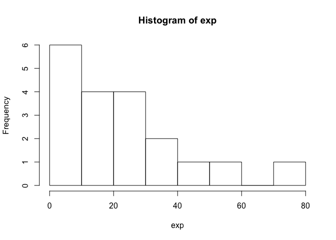
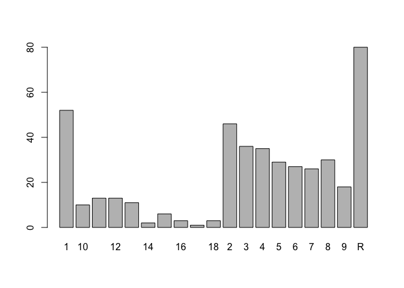

up02-lai-wei
================

``` r
github <- 'https://github.com/ucb-stat133/stat133-hws-fall17/'
repo <- 'raw/master/warmup02/data/nba2017-salary-points.RData'

download.file(
  url = paste0(github, repo),
  destfile = "nba2017-salary-points.RData")

# load the objects
load("nba2017-salary-points.RData")

# list the available objects
ls()
```

    ##  [1] "experience" "github"     "player"     "points"     "points1"   
    ##  [6] "points2"    "points3"    "position"   "repo"       "salary"    
    ## [11] "team"

``` r
print (experience)
```

    ##   [1] "9"  "11" "6"  "R"  "9"  "5"  "4"  "2"  "R"  "6"  "1"  "3"  "2"  "1" 
    ##  [15] "4"  "10" "12" "11" "5"  "1"  "5"  "12" "13" "R"  "8"  "13" "5"  "13"
    ##  [29] "15" "5"  "2"  "5"  "1"  "7"  "7"  "R"  "R"  "4"  "10" "2"  "1"  "5" 
    ##  [43] "R"  "6"  "7"  "2"  "4"  "7"  "1"  "R"  "8"  "8"  "6"  "9"  "5"  "3" 
    ##  [57] "R"  "R"  "3"  "R"  "3"  "12" "8"  "11" "4"  "12" "R"  "14" "3"  "10"
    ##  [71] "3"  "10" "3"  "3"  "6"  "2"  "17" "4"  "4"  "R"  "3"  "8"  "4"  "1" 
    ##  [85] "9"  "R"  "3"  "8"  "12" "11" "R"  "7"  "1"  "6"  "6"  "5"  "11" "1" 
    ##  [99] "6"  "1"  "9"  "8"  "1"  "1"  "1"  "R"  "13" "3"  "1"  "5"  "2"  "3" 
    ## [113] "2"  "R"  "10" "8"  "4"  "8"  "4"  "7"  "9"  "1"  "1"  "6"  "R"  "R" 
    ## [127] "2"  "13" "7"  "1"  "4"  "4"  "12" "1"  "1"  "R"  "6"  "5"  "3"  "5" 
    ## [141] "R"  "3"  "5"  "1"  "5"  "4"  "1"  "1"  "3"  "1"  "4"  "2"  "5"  "9" 
    ## [155] "11" "4"  "4"  "8"  "9"  "R"  "13" "R"  "8"  "7"  "9"  "3"  "1"  "4" 
    ## [169] "5"  "R"  "R"  "R"  "R"  "9"  "R"  "2"  "5"  "9"  "8"  "2"  "2"  "4" 
    ## [183] "8"  "7"  "R"  "1"  "5"  "R"  "R"  "4"  "R"  "R"  "7"  "1"  "8"  "R" 
    ## [197] "1"  "2"  "1"  "3"  "4"  "R"  "1"  "6"  "R"  "4"  "3"  "8"  "R"  "R" 
    ## [211] "6"  "2"  "2"  "2"  "4"  "10" "1"  "2"  "2"  "6"  "12" "R"  "13" "4" 
    ## [225] "3"  "2"  "8"  "9"  "1"  "5"  "13" "R"  "11" "7"  "13" "R"  "7"  "11"
    ## [239] "R"  "R"  "3"  "9"  "1"  "5"  "2"  "10" "14" "7"  "15" "15" "2"  "R" 
    ## [253] "2"  "8"  "R"  "7"  "R"  "11" "1"  "4"  "8"  "1"  "12" "R"  "7"  "4" 
    ## [267] "6"  "11" "R"  "11" "8"  "R"  "10" "16" "8"  "8"  "18" "11" "6"  "5" 
    ## [281] "13" "1"  "6"  "8"  "6"  "3"  "2"  "15" "R"  "1"  "2"  "3"  "5"  "1" 
    ## [295] "R"  "3"  "R"  "2"  "5"  "2"  "1"  "4"  "12" "5"  "8"  "R"  "3"  "7" 
    ## [309] "3"  "R"  "8"  "5"  "R"  "2"  "2"  "1"  "8"  "9"  "12" "3"  "18" "R" 
    ## [323] "R"  "15" "6"  "3"  "3"  "4"  "6"  "6"  "R"  "2"  "4"  "4"  "2"  "1" 
    ## [337] "2"  "R"  "7"  "7"  "1"  "2"  "R"  "12" "R"  "5"  "R"  "3"  "16" "1" 
    ## [351] "8"  "4"  "8"  "6"  "4"  "1"  "R"  "7"  "6"  "4"  "5"  "4"  "7"  "6" 
    ## [365] "R"  "3"  "2"  "R"  "3"  "12" "18" "R"  "2"  "4"  "10" "R"  "2"  "R" 
    ## [379] "1"  "3"  "7"  "R"  "8"  "9"  "3"  "R"  "7"  "6"  "R"  "8"  "2"  "R" 
    ## [393] "10" "R"  "7"  "7"  "1"  "2"  "2"  "8"  "6"  "3"  "7"  "1"  "R"  "1" 
    ## [407] "7"  "5"  "3"  "1"  "2"  "R"  "9"  "1"  "R"  "R"  "2"  "2"  "1"  "12"
    ## [421] "16" "9"  "2"  "4"  "6"  "2"  "1"  "3"  "5"  "R"  "1"  "R"  "2"  "6" 
    ## [435] "9"  "13" "R"  "11" "2"  "R"  "15"

``` r
exp = table(experience)
histogram = hist(exp)
```



``` r
histogram
```

    ## $breaks
    ## [1]  0 10 20 30 40 50 60 70 80
    ## 
    ## $counts
    ## [1] 6 4 4 2 1 1 0 1
    ## 
    ## $density
    ## [1] 0.031578947 0.021052632 0.021052632 0.010526316 0.005263158 0.005263158
    ## [7] 0.000000000 0.005263158
    ## 
    ## $mids
    ## [1]  5 15 25 35 45 55 65 75
    ## 
    ## $xname
    ## [1] "exp"
    ## 
    ## $equidist
    ## [1] TRUE
    ## 
    ## attr(,"class")
    ## [1] "histogram"

``` r
barplot(exp)
```



``` r
print(salary)
```

    ##   [1] 26540100 12000000  8269663  1450000  1410598  6587132  6286408
    ##   [8]  1825200  4743000  5000000  1223653  3094014  3578880  1906440
    ##  [15]  8000000  7806971    18255   259626   268029     5145  9700000
    ##  [22] 12800000  1551659   543471 21165675  5239437 17638063 30963450
    ##  [29]  2500000 15330435  1589640  7330000  1577280 26540100 14200000
    ##  [36]   543471  2703960 14382022 12000000  1921320   874636  5300000
    ##  [43]  1196040  6050000 12250000  3730653 22116750  1200000  1191480
    ##  [50]   543471 15944154  5000000 16957900 12000000  7400000  5893981
    ##  [57]   543471  2870813  3386598  1499760  2708582 23180275  8400000
    ##  [64]   392478 15730338  4000000  2500000  4837500  1015696 20072033
    ##  [71]   418228  3850000  2281605  2995421 17100000  5374320  1551659
    ##  [78] 12517606 15200000   925000  9607500  1403611 10500000  1811040
    ##  [85]  6348759  2568600  2368327  2700000 10230179  4583450   650000
    ##  [92]  8800000  1052342  1800000  4000000  4000000 10770000  2463840
    ##  [99] 18314532  1052342 14153652  3488000  1453680  2112480   874636
    ## [106]  2092200 23200000  1015696  1643040 17552209  1709720  3183526
    ## [113]  5782450   750000 14000000 13219250  2898000 15890000 22116750
    ## [120]  4000000  5782450   874636  2593440  1227000   210995   543471
    ## [127]  5628000  4000000  6000000  1015696 22116750  6500000  1551659
    ## [134]  7000000   874060  1704120  6000000 10991957  3678319  4625000
    ## [141]   650000  2255644 14956522  2969880 17200000  1050961   102898
    ## [148]   874636  5318313  2730000  6511628   161483 12000000  6333333
    ## [155] 12250000 13000000 12500000 20869566  6000000   543471 24559380
    ## [162]   143860 11242000 21323250 17000000  1015696  4317720  3900000
    ## [169]  6191000   543471   543471  2898000   543471  1410598  1375000
    ## [176]  4351320 17000000  5000000  7250000   980431  2613600 17000000
    ## [183] 15000000  6540000    31969  3909840 11750000    31969   950000
    ## [190] 10000000    31969  2318280  9000000  4788840  9424084  4826160
    ## [197]  1514160  2993040  1025831  1015696  8000000    89513   874636
    ## [204]  8550000  1326960  6088993   119494 21165675  1562280  1074145
    ## [211] 11483254   980431  3000000  3333333  1790902  2500000  1395600
    ## [218]   980431   726672  9250000 11131368  1171560  1551659 15330435
    ## [225]  1015696   980431  1403611 26540100  1182840 16663575   383351
    ## [232]   543471  5782450 12112359  2898000   543471 10000000  1551659
    ## [239]   543471  1180080  2898000   165952   874636 17638063  1192080
    ## [246] 20575005 14000000  3578948 15500000 14445313   680534   543471
    ## [253]  1296240 12385364   255000 26540100   543471  7000000  1000000
    ## [260]  6000000 18735364  1720560  7806971   150000  1315448 11000000
    ## [267] 20140838  1551659  1273920 22868828 21165675   543471  7377500
    ## [274] 13253012  2203000  1403611  3500000  1551659  5628000 10154495
    ## [281]  7000000  3940320 11050000  8000000 16073140  1015696  2250000
    ## [288] 11000000   600000   937800  1406520  2121288  2433334  2340600
    ## [295]  5994764  2183072  2440200  2483040 17145838   980431  1191480
    ## [302]  4837500  3750000   247991 26540100   543471  3140517  8950000
    ## [309]  6552960   945000  5700000 22116750  1369229  2898000   980431
    ## [316]  1286160 21165675 26540100  5505618  3332940  4264057  1793760
    ## [323]    83119 10361445  7680965 18500000  3219579 24328425  6666667
    ## [330] 16393443   600000  1921320  8988764  9213484  2751360   874636
    ## [337]  1350120   543471 15050000  8070175  3241800  1655880  3210840
    ## [344]  4540525  1987440 12078652  1627320  2328530  3500000  1358500
    ## [351]  5000000  3533333 11200000  4600000 22116750    20580   543471
    ## [358]  2978250 16957900   576724  8081363   173094 11286518  9904494
    ## [365]    63938 11241218  2090000   650000  1015696  4228000 25000000
    ## [372]   543471  8375000 22116750  4096950    63938  4384490   543471
    ## [379]   874636  2898000 17100000   207798  8000000 12500000  4008882
    ## [386]  3517200  5229454  8000000  2202240  8046500  5200000  1439880
    ## [393] 13333333  1188840  1315448 10661286  3551160  2022240  6006600
    ## [400]  3500000  7643979  2348783  3911380  5960160  3872520  3800000
    ## [407]   138414 13550000  3046299  1339680  2240880  5281680  7600000
    ## [414]  5332800    73528  1034956 12500000  3267120  1207680 18000000
    ## [421]  1551659  5443918  6191000  1050961 16000000  1733880   874636
    ## [428]  4823621 12606250   543471  2223600  4276320    23069 14000000
    ## [435] 10470000  4000000  2941440   282595  2128920   918369 12415000

``` r
max(salary, na.rm = TRUE)
```

    ## [1] 30963450

``` r
min(salary, na.rm = TRUE)
```

    ## [1] 5145

``` r
# mean
mean(salary)
```

    ## [1] 6187014

``` r
# SD:
sd(salary)
```

    ## [1] 6571890

``` r
summary(salary)
```

    ##     Min.  1st Qu.   Median     Mean  3rd Qu.     Max. 
    ##     5145  1286000  3500000  6187000  9250000 30960000

``` r
print (team)
```

    ##   [1] BOS BOS BOS BOS BOS BOS BOS BOS BOS BOS BOS BOS BOS BOS BOS CLE CLE
    ##  [18] CLE CLE CLE CLE CLE CLE CLE CLE CLE CLE CLE CLE CLE TOR TOR TOR TOR
    ##  [35] TOR TOR TOR TOR TOR TOR TOR TOR TOR TOR TOR WAS WAS WAS WAS WAS WAS
    ##  [52] WAS WAS WAS WAS WAS WAS WAS WAS ATL ATL ATL ATL ATL ATL ATL ATL ATL
    ##  [69] ATL ATL ATL ATL ATL MIL MIL MIL MIL MIL MIL MIL MIL MIL MIL MIL MIL
    ##  [86] MIL MIL IND IND IND IND IND IND IND IND IND IND IND IND IND IND CHI
    ## [103] CHI CHI CHI CHI CHI CHI CHI CHI CHI CHI CHI CHI CHI CHI MIA MIA MIA
    ## [120] MIA MIA MIA MIA MIA MIA MIA MIA MIA MIA MIA DET DET DET DET DET DET
    ## [137] DET DET DET DET DET DET DET DET DET CHO CHO CHO CHO CHO CHO CHO CHO
    ## [154] CHO CHO CHO CHO CHO CHO CHO NYK NYK NYK NYK NYK NYK NYK NYK NYK NYK
    ## [171] NYK NYK NYK NYK NYK ORL ORL ORL ORL ORL ORL ORL ORL ORL ORL ORL ORL
    ## [188] ORL ORL ORL PHI PHI PHI PHI PHI PHI PHI PHI PHI PHI PHI PHI PHI PHI
    ## [205] PHI BRK BRK BRK BRK BRK BRK BRK BRK BRK BRK BRK BRK BRK BRK BRK GSW
    ## [222] GSW GSW GSW GSW GSW GSW GSW GSW GSW GSW GSW GSW GSW GSW SAS SAS SAS
    ## [239] SAS SAS SAS SAS SAS SAS SAS SAS SAS SAS SAS SAS HOU HOU HOU HOU HOU
    ## [256] HOU HOU HOU HOU HOU HOU HOU HOU HOU LAC LAC LAC LAC LAC LAC LAC LAC
    ## [273] LAC LAC LAC LAC LAC LAC LAC UTA UTA UTA UTA UTA UTA UTA UTA UTA UTA
    ## [290] UTA UTA UTA UTA UTA OKC OKC OKC OKC OKC OKC OKC OKC OKC OKC OKC OKC
    ## [307] OKC OKC OKC MEM MEM MEM MEM MEM MEM MEM MEM MEM MEM MEM MEM MEM MEM
    ## [324] MEM POR POR POR POR POR POR POR POR POR POR POR POR POR POR DEN DEN
    ## [341] DEN DEN DEN DEN DEN DEN DEN DEN DEN DEN DEN DEN DEN NOP NOP NOP NOP
    ## [358] NOP NOP NOP NOP NOP NOP NOP NOP NOP NOP DAL DAL DAL DAL DAL DAL DAL
    ## [375] DAL DAL DAL DAL DAL DAL DAL DAL SAC SAC SAC SAC SAC SAC SAC SAC SAC
    ## [392] SAC SAC SAC SAC SAC SAC MIN MIN MIN MIN MIN MIN MIN MIN MIN MIN MIN
    ## [409] MIN MIN MIN LAL LAL LAL LAL LAL LAL LAL LAL LAL LAL LAL LAL LAL LAL
    ## [426] LAL PHO PHO PHO PHO PHO PHO PHO PHO PHO PHO PHO PHO PHO PHO PHO
    ## 30 Levels: ATL BOS BRK CHI CHO CLE DAL DEN DET GSW HOU IND LAC LAL ... WAS

``` r
teams = table(team)
BOS_NUM = sum(team == "BOS")
print (BOS_NUM)
```

    ## [1] 15

``` r
print ("Frequency of BOS: ")
```

    ## [1] "Frequency of BOS: "

``` r
print (BOS_NUM / 440)
```

    ## [1] 0.03409091
